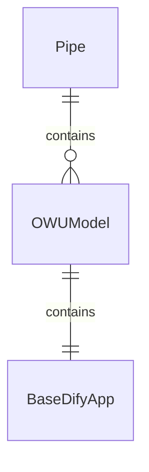
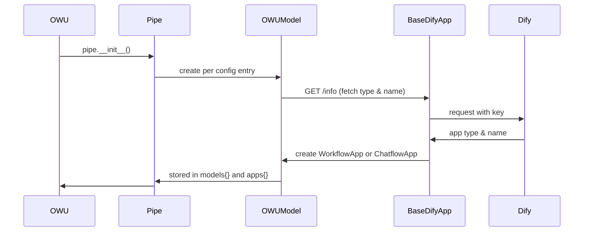
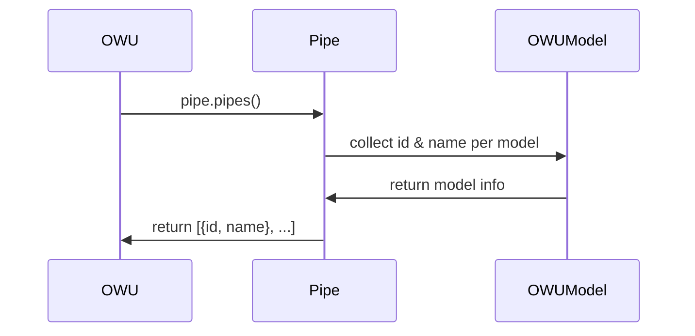
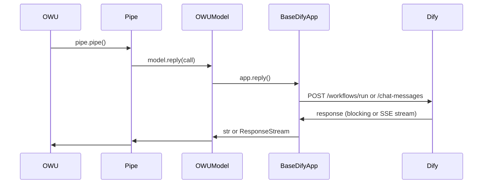

# dify-open-webui-adapter README

Integrate **Open WebUI** and **Dify** by exposing a Dify App
(Workflow or Chatflow) as an Open WebUI model using Open WebUI's
[Pipe Functions](https://docs.openwebui.com/features/plugin/functions/pipe/).


## configurations

User must configure these 2 constant in Python script before use:


### `DIFY_BACKEND_API_BASE_URL`

A `str` representing the **base URL** to access *Dify Backend Service API*, e.g. `"https://api.dify.ai/v1"`


### `APP_MODEL_CONFIGS`

A `list` of model/app config; each config is a `dict` that defines a connected model (of *Open WebUI*) / app (of *Dify*.)

**Required** fields:

- `"key"` (required): Dify App's Backend Service API **secret key**
- `"model_id"` (required): **model id** as used in Open WebUI

**Optional** fields:

- `"name"`: **model name** as appeared in Open WebUI;
  if empty/absent, will fetch app name from Dify to use

- `"disallows_streaming": True/False`: whether **disable streaming** for this connection; streaming may not be available even this is set to `False`; defaults to `False`.

Fields for *Workflow* dify app, (ignored for *Chatflow* dify app):

- `"query_input_field_identifier"`: name of **main input field** set in the *Start* node;
  default to use `"query"`

- `"reply_output_variable_identifier"`: name of **main output variable** set in the *End* node;
  default to use `"answer"`

- additional static *input fields* pass-through: key-value entries that will be passed to *input fields* of Dify App's *Start* node. This is useful to set up settings for the Dify App.

----

example ``APP_MODEL_CONFIGS``

```python
APP_MODEL_CONFIGS = [
    # example Chatflow Dify app
    {
        "key": "25e6ef45-19cb-4c75-b7e1-4380505fbe41",
        "model_id": "example-chatflow-model-1",
        "name": "My Chatflow Based Model",
    }
    # example Workflow Dify App
    {

        "key": "c2fa4d56-dab8-415b-9a55-6059482cb963",
        "model_id": "my-workflow-model-1",
        "name": "",  # fetch directly from Dify
        "query_input_field_identifier": "request",
        "reply_output_variable_identifier": "response",
        # additional static input fields pass-through
        "model_temperature": "0.5",
        "max_token": "2048",
    },
    # more apps
]
```


## Control Flow



#### Initialization



#### Models Listing



#### Replying




